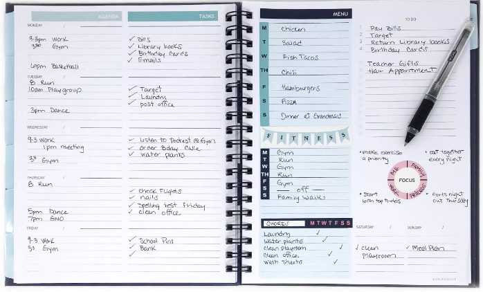
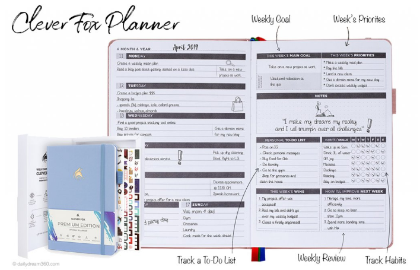

# Kelly Palese Individual Project

This repository contains Kelly Palese's final project for Madison College's Enterprise Java Class. 

### Problem Statement

In recent years, the personal planner industry has expanded quite a bit. Although the traditional planner style (bound paper printed with daily, weekly, or monthly calendar outlines) is still widely available, there is a trend towards planners that allow much more than just tracking the user's schedule. The newer planners allow users to organize items such as goals (e.g. fitness or mindfulness goals), meal planning, chores, and habit tracking. 

The downside to these newer planners is that they are generally large and therefore bulky to carry around. My goal is to create a web application that allows users to track their schedule, goals, and to-do list all in one place without the inconvenience of lugging around a giant paper planner.

Below are two different examples of newer paper planners that serve as some inspiration for my web application:

(Above image courtesy of Target.com)

(Above image courtesy of Dailydream360.com)

### Project Technologies/Techniques 
* Security/Authentication
  * Tomcat's JDBC Realm Authentication
  * Admin role: create/read/update/delete (crud) of all data
  * User role: create planner, add items to planner, edit and delete items previously added
  * All: anyone can read information about the application, but they cannot use the product until they are logged in
* Database
  * MySQL
  * Store users and roles
  * Store all data for calendar, goals, and to-do list
* ORM Framework
  * Hibernate 5
* Dependency Management
  * Maven
* Web Services consumed using Java
  * CALENDAR SERVICE NEEDS TO BE DETERMINED
* CSS 
  * Bootstrap
* Data Validation
  * Bootstrap Validator for front end
  * Explore Hibernate's validation
* Logging
  * Configurable logging using Log4J2. In production, only errors will normally be logged, but logging at a debug level can be turned on to facilitate trouble-shooting. 
* Hosting
  * AWS
* Independent Research Topic/s
    * Drag and drop
    * NEED TO EXPLORE THIS MORE
* Unit Testing
  * JUnit tests to achieve 80%+ code coverage 
* IDE: IntelliJ IDEA

### Design

* [User Stories](DesignDocuments/userStories.md)
* [Screen Design](DesignDocuments/Screens.md)
* [Application Flow](DesignDocuments/applicationFlow.md)
* Database Design TBD

### [Project Plan](ProjectPlan.md)

### [Weekly Refelection](WeeklyReflection.md)